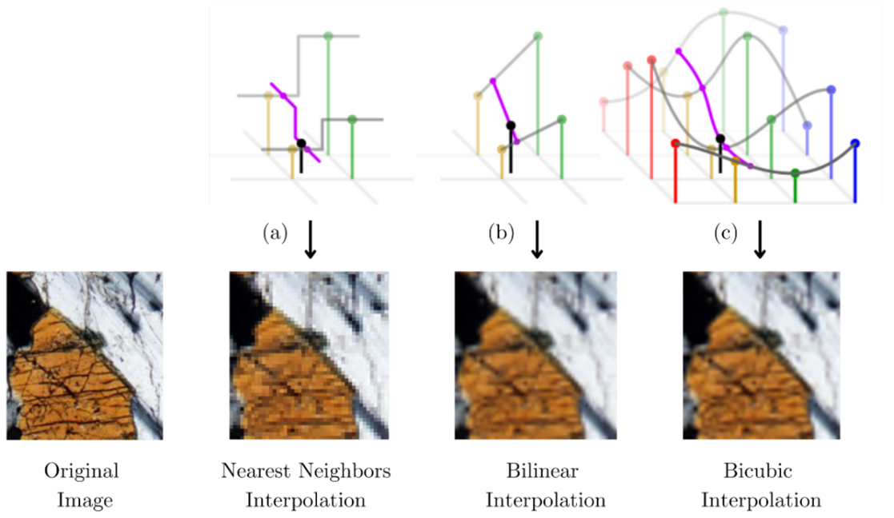

## PetroSR: Petrographic Image Super-Resolution

Petrographic analysis is a technique used to study and classify different types of rocks. To obtain accurate results, the quality of the thin section, image resolution, and subject matter expertise are important factors. However, there is often a trade-off between image resolution and field of view when using microscope cameras, which can make it difficult to identify rocks and minerals from the resulting images. The model SwinIR, which uses a Shifted windows vision transformer for image restoration to significantly improve the resolution of petrographic images without the need for advanced microscope systems. This model has achieved state-of-the-art results and has been shown to improve mineral grain edge detection and segmentation. This work is the first application of a hierarchical vision transformer in petrography for generating superresolution images and has the potential to improve the accuracy of geological descriptions and interpretations. We compare this method with other CNN based methodology, RCAN-IT

Figure 1. Classical computer vision methods for upscaling of images

Figure 2. Four times super-resolution of an ore petrographic image using SwinIR

- Notebook with metric calculations:
metric_calculation.ipynb 

- Original test images and upscaled images:
result_images/

- Models trained available in:
[Models trained for Igneous petrography super-resolution and ore super-resolution](https://drive.google.com/drive/u/1/folders/1sgMMrPRmmz09878YCugrEklrP9Dj5OPM)

- For inference of the model follow requirements and instructions in:
[SwinIR training and inference procedure](https://github.com/cszn/KAIR)

### References

- Liang, Jingyun, Jiezhang Cao, Guolei Sun, Kai Zhang, Luc van Gool, and Radu Timofte. 2021. “SwinIR: Image Restoration Using Swin Transformer.” ArXiv preprint.
- Lin, Zudi, Prateek Garg, Atmadeep Banerjee, Salma Abdel Magid, Deqing Sun, Yulun Zhang, Luc van Gool, Donglai Wei, and Hanspeter Pfister. 2022. “Revisiting RCAN: Improved Training for Image Super-Resolution.” ArXiv preprint.

